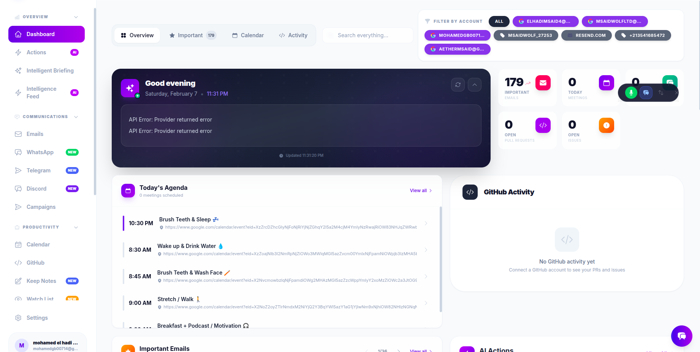
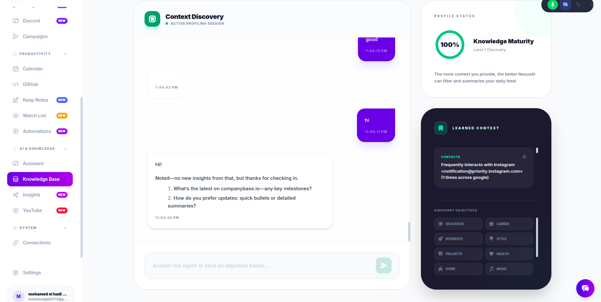
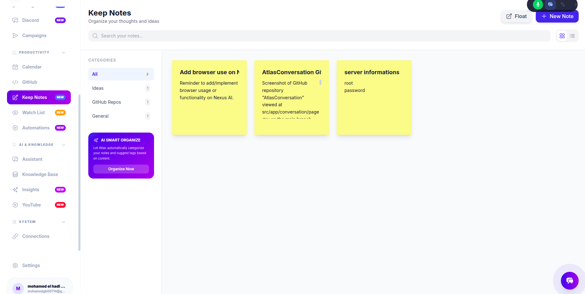
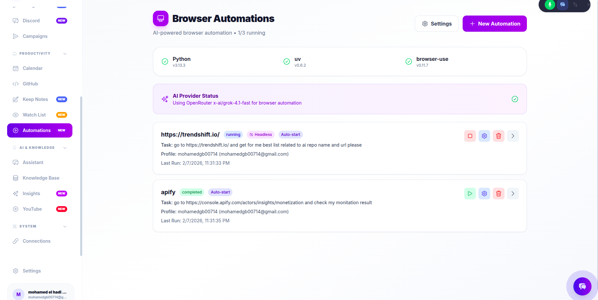

<div align="center">

# aether hub

**Privacy-first, local-only AI-powered personal productivity hub**

[](LICENSE)
[](https://www.electronjs.org/)
[](https://react.dev/)
[](https://www.typescriptlang.org/)
[](https://vitejs.dev/)

[Features](#-features) · [Getting Started](#-getting-started) · [Architecture](#-architecture) · [Download](#-download) · [Contributing](#contributing)

</div>

---

**Transform your digital life with AI-powered automation and intelligence.**

aether hub is your all-in-one productivity powerhouse that synchronizes multiple accounts (Gmail, Outlook, Slack, WhatsApp, Telegram, Discord, GitHub), uses cutting-edge AI to generate actionable insights across all your communications and schedule, and puts you in complete control with **voice commands** — **entirely on your machine**, with **zero cloud dependency**.

🎤 **Control everything with your voice** • 🤖 **6 AI providers supported** • 🔒 **100% private & local** • 🚀 **Extensible & Open Source**

## ❤️ Why I Built This

I built aether hub for my own daily needs.

I was tired of switching between Gmail, WhatsApp, Telegram, Discord, and notes apps. I wanted one private place where everything works together — with AI — without selling my data.

I didn't have money for expensive tools or ads. So I built my own.

Now I'm sharing it with everyone.

## 🎬 Quick Demo

> 60-second overview of aether hub in action

[▶️ Watch Demo](https://github.com/mohamedgb00714/aether-hub/releases) *(Coming soon — video in production)*

## 🛡️ Privacy & Security First

<div align="center">

| 🗄️ **Local Storage** | 🔐 **Encrypted** | 🤖 **Stateless AI** | 💻 **Local AI Ready** | 🚫 **No Telemetry** |
|:---:|:---:|:---:|:---:|:---:|
| All data in SQLite on your machine | Keys secured via OS keychain | Never used for training | Ollama & Local AI support | Zero tracking |

</div>

**Your data stays yours.** Everything runs locally with optional cloud AI — you choose.

## 🌟 Why aether hub?

<table>
<tr>
<td width="50%">

### 🎯 All-in-One Solution
No more switching between 10+ apps. Emails, messages, calendar, tasks, notes — all unified with AI-powered insights in one beautiful interface.

</td>
<td width="50%">

### 🧠 True AI Assistant
Not just a chatbot. LangChain agent with 26+ tools understands your entire digital life and takes contextual action across all platforms.

</td>
</tr>
<tr>
<td width="50%">

### 🎙️ Voice-First Experience
Speak naturally to control everything. Create tasks, send emails, search knowledge base, automate workflows — hands-free.

</td>
<td width="50%">

### ⚡ Automate Everything
Schedule browser automation to scrape data, monitor websites, fill forms. Run complex multi-step workflows while you sleep.

</td>
</tr>
</table>

## 👥 Who Is This For?

aether hub is built for:

- **Developers & makers** managing multiple GitHub accounts and communications
- **Freelancers** juggling client emails, messages, and schedules
- **Students** organizing research, notes, and academic communications
- **Privacy-conscious users** who refuse to let big tech monetize their data
- **Anyone managing 5+ apps daily** and losing hours to context switching

If you use multiple apps every day and value your privacy — this is for you.

## ⚠️ Disclaimer on Third-Party Services

aether hub integrates with third-party platforms such as **WhatsApp**, **Discord**, and **Telegram** using unofficial automation methods.

These integrations:
- Are **not affiliated with, endorsed by, or supported by** Meta (WhatsApp), Discord Inc., or Telegram FZ-LLC
- May violate the Terms of Service of these platforms
- May result in **temporary or permanent account restrictions** or bans
- Are provided **for personal, educational, and research purposes only**
- Are **disabled by default** via environment variables

By enabling these features, you acknowledge and accept all associated risks. The authors assume **no responsibility** for account bans, data loss, or policy violations.

**Users are responsible for ensuring compliance with local laws and platform policies.**

## ✨ Features

| Category | Details |
|----------|---------|
| **Multi-Account Sync** | Gmail, Outlook, Slack, WhatsApp, Telegram, Discord, GitHub |
| **Unified Dashboard** | All communications and schedule in one place |
| **AI Intelligence Engine** | Gemini, OpenAI, Anthropic, OpenRouter, Ollama, Local AI |
| **AI Digest** | Cross-referenced daily summary of all accounts |
| **LangChain Agent** | 26+ database tools for deep conversational AI |
| **Knowledge Base** | Save, organize, and get AI insights from your content |
| **Automations** | Scheduled browser automation with browser-use |
| **Watch System** | Cross-platform monitoring with AI action generation |
| **Browser Extension** | Chrome (MV3) & Firefox (MV2) sidebar with AI chat |
| **Floating Widgets** | System-wide microphone overlay and sticky notes |
| **Email Campaigns** | Resend integration for email sending and campaigns |
| **YouTube Analysis** | Channel tracking, RSS feeds, transcript extraction |
| **Voice Control** | 🎤 Hands-free control with speech recognition and synthesis |
| **...and much more!** | *Custom shortcuts, folder organization, cross-platform search, clipboard history, and 50+ additional features built-in* |

## 📸 Screenshots

<div align="center">

### Dashboard


### Floating Chat


### Knowledge Base


### Keep Notes


### Automations


### Automation Results


</div>

## 🚀 Getting Started

### Prerequisites

- [Node.js](https://nodejs.org/) v18+
- [pnpm](https://pnpm.io/) v9+
- Chrome or Chromium (required for WhatsApp integration)

### Installation

```bash
# Clone the repository
git clone https://github.com/mohamedgb00714/aether-hub.git
cd aether-hub

# Install dependencies
pnpm install

# Configure environment (optional — keys can be added via the app UI)
cp .env.example .env

# Start development
pnpm run dev:electron
```

### Building for Production

```bash
# Full build (Vite + TypeScript + esbuild preload)
pnpm run build:electron

# Package for your platform
pnpm run package:linux   # AppImage + .deb
pnpm run package:mac     # .dmg (Intel + Apple Silicon)
pnpm run package:win     # .exe installer
```

## 🏗️ Architecture

```
aether-hub/
├── electron/              # Main process (Node.js)
│   ├── main.ts            # Window management, IPC handlers, native features
│   ├── preload.ts         # Context-isolated IPC bridge (window.electronAPI)
│   ├── database.ts        # SQLite database (16 tables)
│   ├── ai-service.ts      # Centralized multi-provider AI service
│   ├── security.ts        # Encryption key management via safeStorage
│   ├── addon-server.ts    # WebSocket server for browser extensions
│   ├── whatsapp.ts        # WhatsApp Web automation
│   ├── telegram.ts        # Telegram client integration
│   ├── discord-selfbot.ts # Discord self-bot (experimental)
│   └── youtube.ts         # YouTube channel analysis
├── src/                   # Renderer process (React)
│   ├── pages/             # Route pages (Dashboard, Chat, Emails, etc.)
│   ├── components/        # Reusable UI components
│   ├── services/          # AI, database, sync, and connector services
│   └── types.ts           # Shared TypeScript interfaces
├── browser-addon/         # Browser extensions
│   ├── chrome/            # Chrome extension (Manifest V3)
│   └── firefox/           # Firefox extension (Manifest V2)
└── .github/workflows/     # CI/CD (build + release on tag push)
```

### Key Design Principles

- **Context Isolation** — Renderer never imports Node.js modules; all native ops go through IPC
- **No Hardcoded Secrets** — All keys stored encrypted via `safeStorage` + electron-store
- **Centralized AI** — Single service handles all 6 providers (no duplicated logic)
- **Preload via esbuild** — Separate CommonJS build for sandbox compatibility

## 🌐 Browser Extension

The included browser extensions connect to the desktop app via WebSocket (port 8765):

- **AI Chat** with full markdown rendering
- **Quick access** to emails, calendar, notifications
- **Actions tab** for AI-generated action items
- **Page saving** to Knowledge Base with one click

### Chrome
1. Go to `chrome://extensions/` → Enable Developer mode
2. Click **Load unpacked** → Select `browser-addon/chrome/`

### Firefox
1. Go to `about:debugging#/runtime/this-firefox`
2. Click **Load Temporary Add-on** → Select `browser-addon/firefox/manifest.json`

> The desktop app must be running for the extension to connect.

## 📦 Download

Download the latest release from the [Releases page](https://github.com/mohamedgb00714/aether-hub/releases):

| Platform | File |
|----------|------|
| **Windows** | `aethermsaid-hub-{version}-x64-setup.exe` |
| **macOS (Intel)** | `aethermsaid-hub-{version}-x64.dmg` |
| **macOS (Apple Silicon)** | `aethermsaid-hub-{version}-arm64.dmg` |
| **Linux (AppImage)** | `aethermsaid-hub-{version}-x64.AppImage` |
| **Linux (Debian)** | `aethermsaid-hub-{version}-amd64.deb` |

### Automated Releases

Pushing a version tag triggers GitHub Actions to build for all platforms:

```bash
git tag -a v1.0.0 -m "v1.0.0"
git push origin v1.0.0
```

## 🤝 Contributing

Contributions are welcome! See [CONTRIBUTING.md](CONTRIBUTING.md) for guidelines.

1. Fork the repo
2. Create your branch: `git checkout -b feature/amazing-feature`
3. Commit: `git commit -m "Add amazing feature"`
4. Push: `git push origin feature/amazing-feature`
5. Open a Pull Request

## 🔒 Security

Found a vulnerability? Please report it privately — see [SECURITY.md](SECURITY.md).

## ⭐ Support the Project

If aether hub helps you:

- **Give it a ⭐** — It motivates me to keep improving it
- **Share it** with friends who value privacy
- **Open issues** with ideas, bugs, or feature requests
- **Contribute** code or documentation

Your support makes a real difference ❤️

## 📄 License

[MIT](LICENSE) © msaid mohamed el hadi
